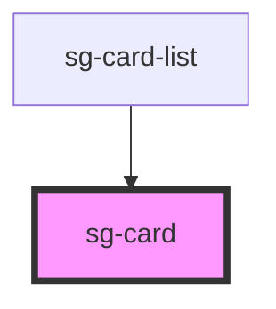

# sg-card

<!-- Auto Generated Below -->

## Properties

| Property    | Attribute    | Description | Type  | Default     |
| ----------- | ------------ | ----------- | ----- | ----------- |
| `cardTitle` | `card-title` |             | `any` | `undefined` |
| `speakers`  | `speakers`   |             | `any` | `undefined` |
| `time`      | `time`       |             | `any` | `undefined` |

## Dependencies

### Used by

 - [sg-card-list](../sg-card-list)

### Graph

----------------------------------------------

*Built with [StencilJS](https://stenciljs.com/)*
